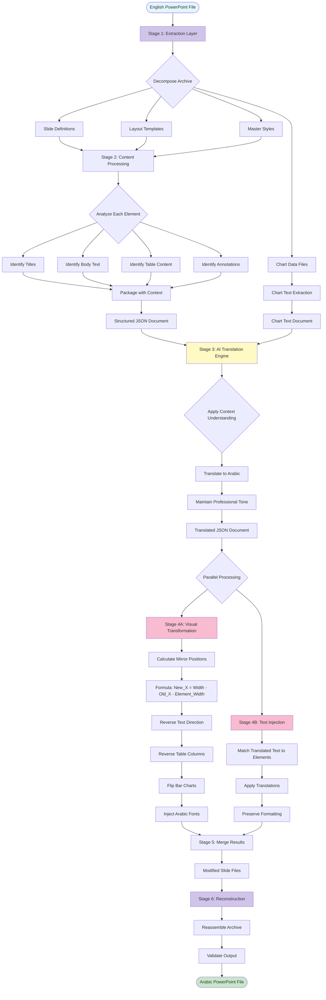
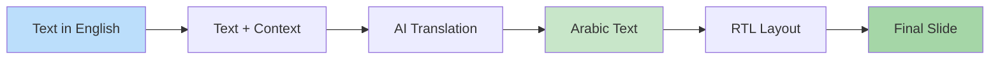
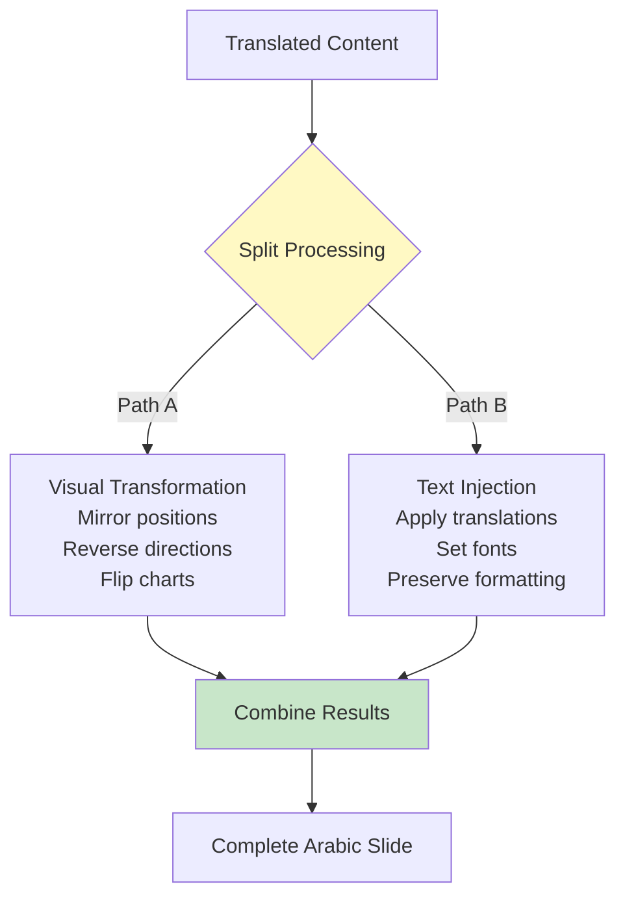
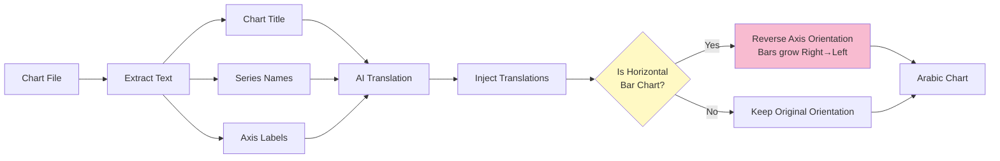
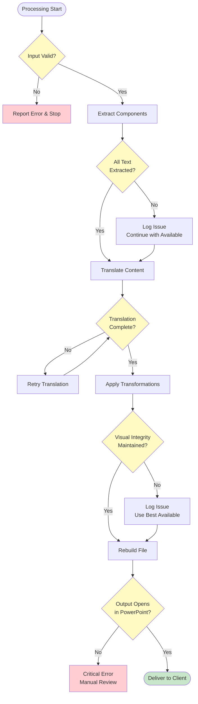

# Slide Translator - Data Flow Diagram

## System Overview: English → Arabic Translation Pipeline

---

## Processing Stages Explained

### Stage 1: Extraction
**Input**: Single PowerPoint file
**Process**: Decompress and separate into components
**Output**: Individual data files (slides, charts, layouts)

### Stage 2: Content Processing
**Input**: Slide data files
**Process**: Identify all text and determine its role (title/body/annotation)
**Output**: Structured document with text + context

### Stage 3: AI Translation
**Input**: Text with context ("This is a title in a strategy slide")
**Process**: AI translates maintaining consulting terminology
**Output**: Arabic translations in same structure

### Stage 4A: Visual Transformation
**Input**: Original slide layout
**Process**: Mirror every element mathematically for RTL
**Output**: Reversed visual layout

### Stage 4B: Text Injection
**Input**: Translated text + transformed layout
**Process**: Insert Arabic text into mirrored positions
**Output**: Complete Arabic slides

### Stage 5-6: Reconstruction
**Input**: All transformed components
**Process**: Reassemble into PowerPoint format
**Output**: Final Arabic presentation

---

## Key Data Transformations

---

## Parallel Processing Architecture

---

## Chart Processing Flow (Advanced Feature)

---

## Quality Assurance Checkpoints

